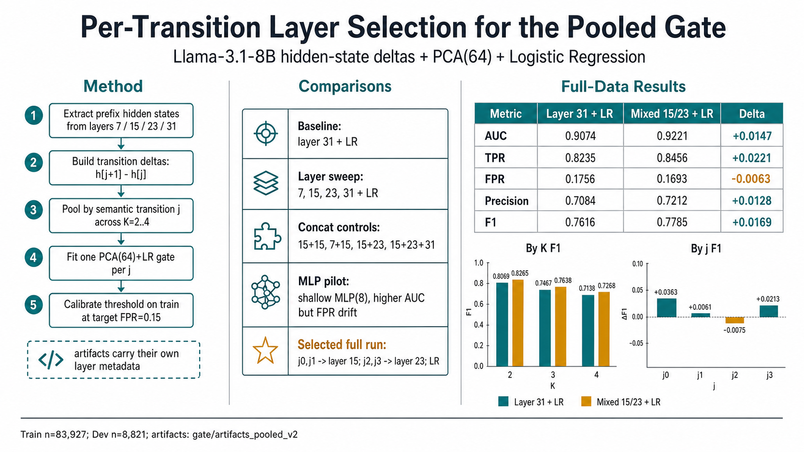

# 0705 update — Gate Layer Selection / Classifier Pilot Experiment

This records the conclusions from this round of gate-related exploratory experiments, for future
follow-up. **The full-scale data validation has finished and the conclusion holds** — see the
"Full-Scale Validation Results (Final Conclusion)" section below. The "Pilot Sub-Sampling
Experiments" section further down is a process record of how this conclusion was originally
worked out (layer sweeps, concat control groups, MLP comparisons, etc.); those numbers are at
pilot scale and are provided for methodology reference only — they don't represent the final
result.

## Background

The current production gate (`gate/artifacts_pooled/`) fixes on Llama-3.1-8B-Instruct's **last
layer (layer 31)** + PCA(64) + LogisticRegression, with all four pooled transitions (j=0..3)
sharing the same layer. This round set out to verify:

1. Is the last layer actually the optimal choice?
2. Can a better feature/classifier combination alleviate the known "K=4 (deep transitions) has
   weak discriminative power" problem (in production dev metrics, K=4's F1 is noticeably lower
   than K=2's)?

## Full-Scale Validation Results (Final Conclusion)

The best configuration worked out during the pilot sub-sampling stage (see below) — **j=0,1 use
layer 15, j=2,3 use layer 23, classifier remains the original LogisticRegression (not MLP, to
avoid the threshold-calibration problem mentioned below)** — has now been re-run on the **full
train set (83,927 examples, not the pilot's 20,615-example sub-sample) + full dev set (8,821
examples)** via `fit_lr_gate_pooled.py --per-j-layers 0:15,1:15,2:23,3:23`. The conclusion holds,
and it's an across-the-board improvement (not a TPR-for-FPR trade-off):

| | AUC | TPR | FPR | Precision | F1 |
|---|---|---|---|---|---|
| 31 + LR (production status quo, full scale) | 0.9074 | 0.8235 | 0.1756 | 0.7084 | 0.7616 |
| **Per-j mix (15,15,23,23) + LR (full scale)** | **0.9221** | **0.8456** | **0.1693** | **0.7212** | **0.7785** |
| Delta | +0.0147 | +0.0221 | -0.0063 (lower is better) | +0.0128 | +0.0169 |

By j:

| j | 31 F1 | Mixed F1 | Delta |
|---|---|---|---|
| j=0 (Q→E1) | 0.7513 | 0.7876 | +0.0363 |
| j=1 (E1→E2) | 0.7699 | 0.7760 | +0.0061 |
| j=2 (E2→E3) | 0.7610 | 0.7535 | -0.0075 (the only regression, and small) |
| j=3 (E3→E4) | 0.7843 | 0.8056 | +0.0213 |

By K (K=4 has always been the weak spot):

| K | 31 F1 | Mixed F1 | Delta |
|---|---|---|---|
| K=2 | 0.8069 | 0.8265 | +0.0196 |
| K=3 | 0.7467 | 0.7638 | +0.0171 |
| K=4 | 0.7138 | 0.7268 | +0.0130 |

Unlike the pilot-stage MLP version (higher AUC but FPR calibration drifted to 0.2348), **this run
uses plain LR**, and its FPR (0.1693) is even slightly lower than the production status quo
(0.1756) — meaning threshold calibration is also accurate here, without the MLP's problem.

Artifacts produced:
- Data: `hidden_states/pilot_multilayer/` (`train_pilot/` is now the full 83,927 examples, `dev/`
  is the full 8,821 examples, all four layers 7/15/23/31 are present in the same multi-layer npz
  storage — no need to maintain a separate layer-31-only directory; see
  `gate/fit_lr_gate.py::collect_split`'s format auto-detection logic).
- Training output: `gate/artifacts_pooled_v2/` (j0~j3.joblib + meta.json, each joblib carries its
  own `"layer"` field recording which layer it actually uses) + `gate/results_pooled_v2/` (dev
  metrics — the source of the numbers in the table above).
- Code changes supporting all of this:
  - `gate/fit_lr_gate.py::collect_split` gained a `layer` parameter that auto-detects whether an
    npz is the production single-layer format or the pilot multi-layer format.
  - `gate/fit_lr_gate_pooled.py` gained `--per-j-layers` (each j can specify a different layer,
    with its own joblib recording which layer it used) and `--train-split-name` (since the pilot
    directory is named `train_pilot` while the production one is `train`).
  - `retrieval/run_retrieval_exp_wavefront.py`: `batch_last_hidden` changed from "read only one
    layer" to "read out all needed layers in a single forward pass"; `score_gate_requests` no
    longer uses one global `--layer` — for each request it reads the `"layer"` field from that
    (K,j) transition's own artifact to decide which layer's hidden state to score with. Per-j
    layer mixing is driven end-to-end by metadata the artifact itself carries — the retrieval
    script has no hardcoded "which hop uses which layer" logic.

**Not yet done**: `artifacts_pooled_v2` has only been trained and set aside so far. It has not
yet:
1. Been formally promoted to replace production `gate/artifacts_pooled/`;
2. Been run through an end-to-end `retrieval/run_retrieval_exp_wavefront.py` to see whether actual
   retrieval/answer metrics (EM/F1/recall) improve accordingly — validation so far has stayed at
   the gate's own TPR/FPR/F1, and the actual downstream impact on the retrieval task hasn't been
   validated yet.

## Pilot Sub-Sampling Experiments (Process Record)

The content below is the series of explorations done on pilot sub-samples before the full-scale
conclusion was reached — it records the process of working from "last layer" step by step toward
the "per-j layer mixing" scheme (layer sweeps, concat control groups ruling out a dimensionality
illusion, MLP comparison, discovery of the threshold-calibration issue). The value here is more
methodological than the specific numbers (which are at pilot scale and don't exactly match the
full-scale conclusion above).

## Experimental Setup

- New scripts (production code untouched):
  - `hidden_states/extract_hidden_states_multilayer_pilot.py` — reads out multiple layers' hidden
    states in a single forward pass (`output_hidden_states=True` computes all 32 layers anyway;
    production code just only read layer 31). Supports incremental disk writes + memory eviction,
    token-budget-adaptive batch size, `--resume`.
  - `gate/compare_layers_pilot.py` — reads the multi-layer npz above, supports single-layer
    comparison / multi-layer concatenation (concat) / per-transition layer mixing (per-j-layers) /
    switching classifiers (LR or a shallow MLP).
- Data:
  - Train: stratified sub-sampling. K=4 (the scarcest, and the sole data source for pooled j=3)
    is **kept in full** (2,023 examples/bucket); K=2/K=3 buckets are each capped at 1,500 examples
    (these two K values are already much richer than K=4 and simultaneously serve multiple pooled
    j's, so the reduction has less impact on the result). 20,615 examples total.
  - Dev: full 8,821 examples, not sub-sampled.
  - Classifiers are all trained on the 64-dim features output by PCA(64) (consistent with the
    production pipeline) — only the model after PCA, or the raw layer fed into PCA, changes.

## Results Summary

| Config | j=0 (Q→E1) | j=1 (E1→E2) | j=2 (E2→E3) | j=3 (E3→E4) | Overall |
|---|---|---|---|---|---|
| 31 + LR (**production status quo**) | 0.9264 | 0.8925 | 0.8531 | 0.8674 | 0.9007 |
| 7 + LR | 0.7814 | 0.7683 | 0.6970 | 0.7536 | 0.7589 |
| 15 + LR | 0.9497 | 0.9005 | 0.8338 | 0.8739 | 0.9151 |
| 23 + LR | 0.9377 | 0.9037 | 0.8465 | 0.8850 | 0.9113 |
| concat(15+15) + LR (control group, testing "is more dimensions alone enough?") | 0.9494 | 0.9010 | 0.8343 | 0.8736 | 0.9152 |
| concat(7+15) + LR | 0.9479 | 0.9011 | 0.8375 | 0.8798 | 0.9145 |
| concat(15+23) + LR | 0.9434 | 0.9004 | 0.8513 | 0.8911 | 0.9147 |
| concat(15+23+31) + LR | 0.9262 | 0.8929 | 0.8543 | 0.8677 | 0.9010 |
| 15 + MLP(8) | 0.9529 | 0.9113 | 0.8523 | 0.8738 | 0.9254 |
| 23 + MLP(8) | 0.9415 | 0.9104 | 0.8604 | 0.9004 | 0.9205 |
| concat(15+23) + MLP(8) | 0.9479 | 0.9122 | 0.8537 | 0.8943 | 0.9238 |
| **Per-j mix (0,1→15; 2,3→23) + MLP(8)** | **0.9529** | **0.9113** | **0.8604** | **0.9004** | **0.9266** |

MLP is uniformly a single hidden layer, 8 neurons, ReLU activation
(`sklearn.neural_network.MLPClassifier`), deliberately kept shallow to avoid the question of
"is the conclusion really about the trace signal itself, or is it just the classifier's
capacity doing the work" (in keeping with the long-standing "keep the gate simple" design
philosophy).

## Confusion-Matrix Metrics (TPR / FPR / Precision / F1)

Thresholds were calibrated on the training set at `target_fpr=0.15` (the same recipe as
production `fit_lr_gate_pooled.py`). **Only the rows below were read out from the complete JSON;
the other configs (concat(15+15)/concat(7+15)/concat(15+23+31)/15+MLP/23+MLP/concat(15+23)+MLP)
only had their terminal-printed AUC table saved at the time — `layer_compare_metrics.json` gets
overwritten on every run, so those configs' TPR/F1 numbers are no longer recoverable and would
need to be re-run if needed.**

| Config | TP | FP | FN | TN | TPR | FPR | Precision | F1 |
|---|---|---|---|---|---|---|---|---|
| 31 + LR (production status quo, pilot scale) | 5340 | 2464 | 1064 | 9902 | 0.8339 | 0.1993 | 0.6843 | 0.7517 |
| 7 + LR | 3700 | 2516 | 2704 | 9850 | 0.5778 | 0.2035 | 0.5952 | 0.5864 |
| 15 + LR | 5487 | 2451 | 917 | 9915 | 0.8568 | 0.1982 | 0.6912 | 0.7652 |
| 23 + LR | 5425 | 2481 | 979 | 9885 | 0.8471 | 0.2006 | 0.6862 | 0.7582 |
| concat(15+23) + LR | 5464 | 2452 | 940 | 9914 | 0.8532 | 0.1983 | 0.6902 | 0.7631 |
| **Per-j mix (0,1→15; 2,3→23) + MLP(8)** | 5758 | 2903 | 646 | 9463 | **0.8991** | **0.2348** | 0.6648 | 0.7644 |

**One caveat**: the per-j-mix + MLP row has the highest AUC and highest TPR (0.8991, notably
higher than the production status quo's 0.8339 — fewer misses), but its **actual FPR is 0.2348,
noticeably above the calibration target of 0.15** — even higher than the production status quo's
0.1993. This means the threshold calibration (calibrated on train, then used on dev) isn't as
accurate for MLP as it is for LR. Likely reason: LogisticRegression's output probabilities are
naturally "smoother" and transfer well between train/dev; MLP is more flexible, so a threshold
calibrated on train doesn't necessarily reproduce the same FPR stably on dev. This means that if
MLP were actually to be deployed to production, **the threshold-calibration step would need to be
redesigned or validated more carefully** (e.g. also considering early-stopping/cross-validation
splits during calibration) rather than directly reusing LR's current calibration method. The
AUC-level improvement is real, but "exactly how many times a given threshold actually fires" is
something the MLP version hasn't been tuned for yet.

## Key Conclusions

1. **The last layer (31) is not the optimal layer.** Middle layers (15, 23) have overall AUC
   1–1.5 points higher than 31 at the same training scale.
2. **Different layers excel at different transitions**: 15 is stronger for shallow transitions
   (j=0/j=1, when the question has just been unfolded); 23 is stronger for deep transitions
   (j=2/j=3, corresponding to the harder K=3/K=4 hops) — and 23 is the single best config on its
   own for j=2/j=3, even beating concat(15+23).
3. **The "more dimensions is just better" illusion is ruled out**: the concat(15+15) control group
   (the same layer concatenated with itself) performs almost identically to a single layer alone
   (0.9152 vs 0.9151), showing that stacking dimensions alone does nothing; only concatenating
   genuinely **different** layers helps, and the gain is concentrated where the two layers
   complement each other (deep transitions).
4. **Adding 31 into the concat actually hurts** (concat(15+23+31) overall drops to 0.901, close
   to 31 alone), suggesting layer 31's information quality is comparatively weak — mixing it in
   dilutes 15/23's advantage. A plausible reason: the last layer is most heavily shaped by the
   "predict the next token" training objective, which may compress away some of the abstract
   "is this segment coherent/self-consistent" semantic signal; a mid-to-late layer like 23 isn't
   yet as dominated by that pressure and retains it more fully.
5. **A shallow MLP (1 hidden layer + ReLU) gives a stable but modest improvement over plain LR**,
   consistently across every tested config (not just gains on one transition), and it's measured
   on the dev set which wasn't part of training — this doesn't look like overfitting noise.
6. **Current best scheme**: choose the layer per transition (j=0,1 use 15; j=2,3 use 23) + a
   shallow MLP, rather than "one layer for everything" or "hard-concatenating two layers." The
   pooled protocol already trains an independent model per j, so there's no rule that they must
   share the same layer's features — this mixed scheme is architecturally natural, not added
   complexity.
   - Overall AUC: 0.9007 (production status quo) → **0.9266** (+0.026)
   - j=3 (K=4's last hop, historically the weak spot): 0.8674 → **0.9004** (+0.033)
7. **But the MLP version's threshold calibration still isn't tuned.** Per-j-mix + MLP, under a
   calibration target of FPR=0.15, actually measures FPR=0.2348 on dev — higher than the
   production status quo's 0.1993. The AUC/ranking-quality improvement is real, but "where exactly
   this threshold should be set" isn't something the current LR-based calibration method handles
   accurately for MLP — this needs to be solved separately before going to production.

## Next Steps

The full-scale validation is done (see "Full-Scale Validation Results" above) and the conclusion
holds. What's left:

1. **Decide whether to promote `gate/artifacts_pooled_v2/` to replace production
   `gate/artifacts_pooled/`** — this is a human decision point, not a technical one: full-scale
   gate metrics (TPR/FPR/F1) have been confirmed to improve across the board, but the actual
   impact on the **downstream retrieval task** (recall/EM/F1) hasn't been validated yet.
2. **Run an end-to-end `retrieval/run_retrieval_exp_wavefront.py`** comparing `artifacts_pooled_v2`
   against the current production `artifacts_pooled`'s retrieval performance — this is the one
   validation step not yet run, and the last piece of the puzzle before deciding on promotion. The
   retrieval script has already been updated to score per-layer automatically based on the
   artifact's own `"layer"` metadata, so no further code changes are needed — just point
   `--artifacts-dir` at `artifacts_pooled_v2`.
3. **MLP version shelved for now**: at the pilot stage, MLP's AUC was even a bit higher than plain
   LR's (0.9266 vs 0.9147, pilot scale), but the threshold-calibration drift (FPR 0.2348 far
   exceeding the 0.15 target) wasn't resolved, so this full-scale validation deliberately went with
   the pure-LR per-j-layer-mix scheme, without introducing MLP. If this remaining potential is
   worth squeezing out later, the MLP's threshold-calibration approach needs to be redesigned first
   (e.g. calibrating on a held-out split from early stopping rather than the full training set),
   then a new full-scale validation run.
4. Optional deeper investigation (not urgent): test a few more layers between 23 and 31 (e.g. 27,
   29) to pin down exactly where the deep-transition "sweet spot" layer is, for a better
   understanding of this "depth shifts with hop count" phenomenon.
